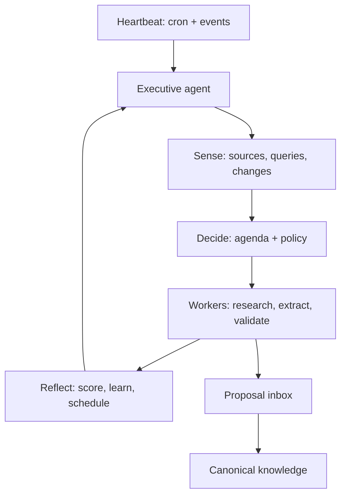

# Research Memory Layer for Second Brain

**Status:** evidence-backed design assessment  
**System assessed:** `Ntrakiyski/second-brain`, `main`, architecture document blob `18342ed8d40a99bbd5ad3af8710ecb853a8853e4`  
**Date:** 2026-07-13  
**Scope:** turning Second Brain into a citable technical knowledge base for AI-model and systems research, without discarding its general shared-memory role.

## Executive decision

Keep the existing low-latency personal/team memory system. Do **not** replace it with a GraphRAG stack or change embedding models first. Add a separate, provenance-first **Research Memory Layer** on the same storage/retrieval foundation, then measure it with an in-domain benchmark.

The present design is competent for short, evolving team memories. It is not yet sufficient for rigorous research knowledge because a recalled item cannot reliably answer: *which paper, which section/page, which experiment, under what conditions, and is this a measured result or an inference?* That is a schema and evaluation gap, not an embedding-model gap.

## North star: a living knowledge organism

The end state is not a passive memory store. It is a **governed, continuously learning knowledge organism** that can research while the team sleeps, propose new knowledge, detect change, connect evidence to existing architecture decisions, and make the next day’s work more informed.

It must operate as a closed but reviewable loop:

```text
Observe → Acquire → Parse → Extract claims → Link/contrast → Evaluate → Propose → Review → Publish → Monitor
```

- **Observe:** watches approved source feeds, repositories, model releases, papers, internal decisions, and unanswered or low-confidence queries.
- **Acquire and parse:** stores immutable source snapshots, versions, metadata, sections, and evidence spans before producing any summary.
- **Extract and link:** proposes claims and typed, evidence-bearing relations such as `supports`, `contradicts`, `extends`, `uses_method`, `evaluates_on`, and `has_limitation`.
- **Evaluate:** runs retrieval, citation, novelty, source-quality, and contradiction checks against the current corpus.
- **Propose:** creates a reviewable *knowledge proposal*—never an automatic canonical fact—with exact evidence, confidence, diff from existing knowledge, affected projects, and recommended action.
- **Review and publish:** a human or delegated policy agent approves, rejects, or qualifies the proposal. Only approved items become canonical and affect normal recall.
- **Monitor:** rechecks time-sensitive sources, detects corrigenda/retractions/new model versions, and marks affected claims as superseded or needing review.

The critical design rule is **separate discovery from truth**. Autonomous agents may search, extract, summarize, and propose. Canonical knowledge requires evidence lineage plus an explicit review policy. This preserves the speed of an overnight research agent without creating a self-reinforcing hallucination loop.

## The actual living organism: a persistent knowledge agent

**Cron is not the agent. Cron is its heartbeat.** The living component is a persistent executive that wakes with a durable state, observes what changed, decides the highest-value next action, delegates work, evaluates the result, and updates its own agenda for the next run.

It lives *inside* Second Brain as a first-class subsystem, not as an external script that periodically dumps summaries into memory.



### Its mind: durable executive state

The executive must resume from a database record on every run. It does not rely on a long chat transcript or an LLM's context window.

```text
knowledge_agent_state
  agent_id, mode: active|paused|budget_exhausted|needs_review,
  mission, active_priorities, current_hypotheses,
  daily_budget, budget_spent, last_heartbeat_at, next_wake_at,
  last_run_id, health, policy_version

research_agenda
  id, question, project_id, why_now, priority_score,
  evidence_gap, freshness_deadline, source_policy,
  status: queued|claimed|researching|blocked|proposed|resolved|deferred,
  next_action, next_check_at, parent_agenda_id

agent_runs
  id, started_at, trigger, state_snapshot, selected_agenda_id,
  plan_json, actions_json, source_ids, outcome, cost, latency,
  reflection, next_actions, stop_reason

agent_events
  id, type, payload, priority, occurred_at, consumed_at
  # source_changed | user_question | unanswered_query | contradiction |
  # project_decision | review_outcome | scheduled_check | run_failed

knowledge_proposals
  id, agenda_id, claim/change, evidence_ids, affected_claim_ids,
  confidence, novelty, risk, recommended_action,
  status: draft|validating|awaiting_review|approved|rejected|auto_published
```

### Its reflexes: events and heartbeats

The existing nightly cron becomes only one trigger. Every meaningful occurrence creates an `agent_event`; the scheduler batches events and wakes the executive within a defined budget.

| Trigger | What the organism notices | Typical decision |
|---|---|---|
| New paper, release, repo commit, internal document | A watched source changed | Compare it to affected canonical claims; research only if material |
| Team asks a question with weak/no evidence | Knowledge gap | Create agenda item, answer cautiously now, research later |
| New claim conflicts with a canonical one | Possible knowledge drift | Open a contradiction investigation; preserve both until resolved |
| Approved/rejected proposal | Feedback | Update source quality, retrieval labels, agenda, and future policy |
| Daily heartbeat | Staleness, budget, unresolved critical questions | Pick the highest-value safe task or do nothing |

### Its decision loop

At each wake, the executive takes one bounded planning step—not an open-ended "research everything" instruction.

```text
1. Load state, policy, budget, unresolved agenda, new events, and last-run reflection.
2. Generate candidate actions:
   - inspect a source delta
   - research a high-impact question
   - validate a candidate claim
   - challenge a stale/conflicting claim
   - improve an observed retrieval failure
   - stop / defer
3. Deterministically score and filter candidates.
4. Let the LLM choose and plan only among legal candidates.
5. Delegate bounded work to specialist workers.
6. Validate output against evidence, policy, and budget.
7. Write an append-only run record and schedule the next action.
```

The score should be explicit, not hidden inside a prompt:

```text
priority = impact × evidence_gap × change_risk × freshness_urgency
           × expected_information_gain
           − estimated_cost − duplicate_coverage − safety_risk
```

The LLM supplies judgement for *how* to research; the deterministic policy decides *whether it may* and *what it may change*.

### Its organs: specialist workers

| Worker | Receives | Can do | Returns |
|---|---|---|---|
| Source sentinel | watched source + last snapshot | fetch, hash, diff, classify materiality | source-change event or no-op |
| Researcher | one agenda item + source policy + budget | search, read, cite, find counter-evidence | evidence bundle and research notes |
| Evidence extractor | source bundle | segment, anchor pages/sections, extract candidate claims | passages + claim candidates |
| Contradiction analyst | candidate + existing claims | compare scope, dates, methods, and evidence | supports/qualifies/contradicts decision with reasons |
| Knowledge editor | validated candidates only | construct proposal and affected-claim diff | reviewable `knowledge_proposal` |
| Evaluator | runs and reviewer feedback | score citation quality, novelty, retrieval outcome, and cost | reflection + agenda updates |

Workers are stateless and replaceable. The executive, agenda, evidence ledger, policy, and proposal inbox are the organism's long-lived body.

### Its overnight rhythm

Use the existing scheduled handler to enqueue jobs; execute each job as a bounded run so one bad paper, tool error, or LLM loop cannot consume the night.

| Window | Run | Output |
|---|---|---|
| Every 1–2 hours | Lightweight source sentinel | Diffs/events only; no synthesis unless material |
| 01:00 | Executive planning run | Selects 1–N agenda items within the daily budget |
| 01:10–04:00 | Research worker runs | Evidence bundles, counter-evidence, candidate claims |
| 04:00 | Validation + contradiction run | Safe proposals or explicit blocked/uncertain result |
| 04:30 | Reflection + maintenance run | Updates agendas, source freshness, evaluation labels, next wake time |
| Morning | Digest notifier | “What changed / needs your decision / what I will research next” |

The hour values are policies, not product logic. For the MVP, run a single nightly executive cycle plus lightweight event capture. Move to several heartbeats only after cost, failure, and proposal quality are measured.

### What the agent can decide by itself

| Decision | Autonomy level |
|---|---|
| Watch a pre-approved source, hash it, and detect a change | Automatic |
| Create a research agenda item from a repeated unanswered question | Automatic |
| Search approved sources and save raw evidence/episodes | Automatic |
| Create candidate claims, links, summaries, or contradiction investigations | Automatic, but draft-only |
| Mark a source stale or schedule a recheck | Automatic |
| Change a canonical technical claim | Requires reviewer/policy evidence gate |
| Delete evidence, change permissions, spend beyond budget, or alter its own policy | Never autonomous |

### Living-agent MVP: build this before Graphiti migration

1. Add `agent_events`, `research_agenda`, `agent_runs`, `knowledge_proposals`, and `knowledge_agent_state` to D1.
2. Turn the current cron handler into an **orchestrator**: enqueue/run the executive, never call one giant summarization prompt.
3. Implement `observe → decide → research → validate → propose → reflect` as explicit modules with persistent input/output records.
4. Ship a minimal proposal inbox in the dashboard: approve, qualify, reject, defer, and inspect evidence/diff.
5. Add source watch lists and three initial agenda types: `stale claim`, `unanswered team question`, `new release/paper`.
6. Run in draft-only mode for 30 days. Its first job is to learn what is valuable enough to research—not to rewrite your truth.

After this MVP is functioning, Graphiti can replace or augment the fact/relationship substrate beneath it. The executive agent and control plane remain yours either way.

### Operating modes

| Mode | Trigger | Allowed output | Cannot do |
|---|---|---|---|
| Nightly scout | scheduled source/watch-list scan | candidate documents, claim proposals, change alerts | alter canonical claims |
| Gap researcher | recurring unanswered/low-confidence queries | research brief and source shortlist | infer unsupported conclusions |
| Contradiction monitor | new source conflicts with a canonical claim | evidence-backed challenge, impact list | delete or overwrite the incumbent claim |
| Architecture advisor | new evidence touches a project decision | decision update proposal with trade-offs | change production architecture |
| Corpus maintainer | quality/expiry checks | re-index or mark stale; evaluation report | compress or discard evidence without lineage |

### Required controls

1. **Immutable source ledger:** hash, origin, version, ingestion time, access rights, and extraction method for every source.
2. **Epistemic states:** `candidate`, `reviewed`, `canonical`, `qualified`, `superseded`, `retracted`, and `unanswerable`; never collapse these into one free-text tag.
3. **Evidence gates:** every canonical claim needs at least one anchored passage; high-impact technical recommendations need an explicit source-quality and counter-evidence check.
4. **Novelty and duplication checks:** compare a proposal against claims, not only embeddings of raw memories.
5. **Policy and budget controls:** source allow-lists, per-run quota, rate limits, provenance requirements, and a dead-letter queue for failed extraction/review.
6. **Auditability:** retain prompt/model/version, candidate set, tool calls, evaluator scores, reviewer decision, and the exact corpus snapshot used.

### Evolution path

P0–P3 below create the substrate. Add a **P4 Research Agent Loop** after P1 quality metrics are stable: begin with a daily read-only scout that produces proposals and an inbox/dashboard; then allow approved proposals to generate follow-up research tasks. Autonomous re-indexing and relationship extraction can be enabled earlier, but autonomous canonical publication should remain policy-gated.

### Research expansion: the missing control plane

The supplied research correctly identifies that a nightly pipeline alone is insufficient. The organism needs a **memory control plane**: explicit operations, a policy for selecting them, and enforced state transitions.

Recent agent-memory work provides useful direction. AgeMem exposes `store`, `retrieve`, `update`, `summarize`, and `discard` as policy actions and trains their selection jointly with task behavior; its long-horizon results support treating memory management as an agent decision problem rather than a fixed CRUD controller. [Yu et al., 2026](https://consensus.app/papers/agentic-memory-learning-unified-longterm-and-shortterm-yu-yao/47f8c1b4342554858d80f22d97f5a94b/?utm_source=chatgpt) (arXiv; 28 citations). A-MEM independently supports dynamic organization and evolution of interconnected notes, though its automatic links must still be treated as hypotheses in a research corpus. [Xu et al., 2025](https://consensus.app/papers/amem-agentic-memory-for-llm-agents-xu-liang/3063d0f87e5057d596424b482a9049c8/?utm_source=chatgpt) (arXiv; 651 citations).

**System consequence:** expose memory operations to the research agent, but start with a deterministic policy wrapper rather than training a reinforcement-learning memory manager. The agent may choose *what to investigate or propose*; the wrapper decides whether its proposed operation is legal, sufficiently evidenced, inside budget, and allowed to change state. Learn the policy only after enough audited decision traces exist.

```text
Research agent intent
  → propose_capture | propose_claim | propose_relation | propose_summary |
    propose_challenge | propose_research_task | retrieve_evidence
  → control-plane validation
      (permissions, source policy, dedupe, evidence, temporal checks, budget)
  → draft/proposal state + audit record
  → reviewer or policy gate
  → canonical/qualified/superseded state
```

This also addresses the primary failure case of living memory: recursive self-corruption. SSGM argues for decoupling memory evolution from execution and applying consistency verification, temporal modeling, and dynamic access control before consolidation. It is a recent conceptual paper rather than deployment proof, but its risk model directly matches this architecture. [Lam et al., 2026](https://consensus.app/papers/governing-evolving-memory-in-llm-agents-risks-mechanisms-lam-li/4f6b727852025993b39f4520afa68150/?utm_source=chatgpt) (arXiv; 5 citations).

### Temporal truth: add bi-temporal claims and relations

For a knowledge organism, `created_at` is not enough. A claim needs two clocks:

- **valid time:** when the claim is asserted to hold in the world, e.g. a model version is current from date A until date B;
- **transaction time:** when Second Brain learned, reviewed, corrected, or retired that assertion.

Bitemporal knowledge-graph work distinguishes these clocks and combines them with confidence for uncertain extracted facts. [Chekol & Stuckenschmidt, 2018](https://consensus.app/papers/towards-probabilistic-bitemporal-knowledge-graphs-chekol-stuckenschmidt/e85d46139198543bbaf51ea372c24c16/?utm_source=chatgpt) (Web Conference Companion; 7 citations). More recent temporal-RAG work likewise models identical facts from different times as distinct relations, rather than overwriting one embedding with another. [Han et al., 2025](https://consensus.app/papers/rag-meets-temporal-graphs-timesensitive-modeling-and-han-cheung/67c1fc783aac5ecab4e28aeae7da0217/?utm_source=chatgpt) (arXiv; 6 citations).

**Implementation rule:** never mutate an evidence-backed claim in place. Close its valid interval or mark it qualified/superseded, then create a new claim version linked by `supersedes` or `corrects`. Queries such as “what did we believe in March?” and “what is current according to the latest evidence?” become answerable and auditable.

### Two-speed knowledge metabolism

| Plane | Purpose | Agent permission | Storage state |
|---|---|---|---|
| Fast discovery plane | High-recall exploration of feeds, releases, papers, repos, and internal artifacts | Autonomously ingest snapshots, extract candidates, schedule research, re-index | `candidate`, `draft`, `needs_review` |
| Slow truth plane | Stable shared knowledge used to guide people and agents | Publish only through evidence and policy/reviewer gate | `reviewed`, `canonical`, `qualified`, `superseded`, `retracted` |

The fast plane should be intentionally noisy; it is the organism’s sensory system. The slow plane should be conservative; it is the system of record. Retrieval must show the epistemic state and default to the slow plane for technical recommendations, while allowing an explicit “include research proposals” mode.

### Standing research agenda, not a blind nightly crawl

Add `research_agenda` records that make the system's curiosity explicit:

```text
id, question, scope/project, hypothesis, priority, source_policy,
freshness_window, evidence_standard, uncertainty_score, change_risk,
last_checked_at, next_check_at, budget, status
```

Prioritize a research task from a transparent score: **project impact × uncertainty × expected information gain × change risk**, reduced by cost and duplicate coverage. Useful triggers are: repeated unanswered queries, a high-impact canonical claim with stale evidence, a new model/repository release, a contradictory paper, and a pending architectural decision.

Each run must produce a *delta* rather than another generic summary: `new evidence`, `what changed`, `what remains uncertain`, `which existing claims are affected`, `recommended action`, and `why no automatic publication occurred`.

### P4 — implement the research-agent loop

| Action | Implementation result | Acceptance criteria |
|---|---|---|
| Add control-plane operation contracts | Schema-validated proposal tools and legal state transitions | Agent cannot write canonical truth, replace evidence, or cross visibility boundaries directly |
| Add bitemporal fields | `valid_from/to`, `recorded_at`, `superseded_at`, `reviewed_at` on claims and relations | Time-travel and current-state queries return different, explainable results on seeded changed facts |
| Add research agenda + scheduler | Standing questions, approved source policy, budgets, and change triggers | Nightly run completes one agenda item and produces a provenance-complete proposal/delta |
| Add proposal inbox | Reviewer sees evidence spans, source quality, confidence, duplicates, affected claims, and diff | Reviewer can approve, qualify, reject, or request more research; decision is immutable/audited |
| Evaluate autonomy | Run a 30-day shadow period with no automatic publication | Measure proposal precision, accepted-proposal rate, stale-claim detection recall, cost/run, and harmful-update rate before enabling more autonomy |

### Existing open-source building blocks — exact fit assessment

**Conclusion:** no single repository currently provides the full governed knowledge organism: research acquisition, evidence-level provenance, bitemporal truth, autonomous agenda selection, policy-gated publication, and evaluation. The closest practical composition is **Graphiti + a research worker + the Second Brain control plane**.

| Repository | What it genuinely provides | Fit for this project | Critical gap / integration cost |
|---|---|---|---|
| [getzep/graphiti](https://github.com/getzep/graphiti) | Temporal context graph; source episodes; fact validity windows; incremental ingestion; prescribed/learned ontology; hybrid semantic/BM25/graph retrieval; MCP server | **Best substrate candidate.** Its `episode → entity/fact` lineage and temporal fact invalidation directly implement the provenance and time model missing from Second Brain | Python plus Neo4j/FalkorDB/Neptune/OpenSearch, not Cloudflare D1/Vectorize. Its MCP exposes destructive graph operations, so put the project control plane in front of it rather than exposing it as the canonical write interface |
| [langchain-ai/open_deep_research](https://github.com/langchain-ai/open_deep_research) | Configurable multi-provider research workflow, search/MCP integration, source summarization/compression, report generation, Deep Research Bench evaluation | **Best research-worker candidate.** Fork/use as the nightly scout and replace its final-report sink with `knowledge_proposal` creation | Does not itself maintain a governed temporal knowledge base, research agenda, reviewer inbox, or claim-evidence model |
| [topoteretes/cognee](https://github.com/topoteretes/cognee) | Broad AI-memory platform: ingestion, graph/vector search, ontology grounding, `remember`/`recall`/`forget`/`improve`, local/self-hosted operation, agent isolation and traceability claims | **Good all-in-one spike / alternative platform.** Most useful if you are ready to move the core away from the current Worker-centric design | It is a large Python platform and a replacement-level decision; its README does not establish Graphiti-style bitemporal claim semantics or the proposal-to-canonical governance workflow required here |
| [langchain-ai/langmem](https://github.com/langchain-ai/langmem) | Agent tools for memory management/search plus a background memory manager that extracts, consolidates, and updates knowledge | **Useful control-plane reference or optional worker component** if the research agent runs on LangGraph | Generic agent memory; needs an external provenance, graph, temporal, and review model. It should not be the canonical knowledge store |
| [mem0ai/mem0](https://github.com/mem0ai/mem0) | User/session/agent memory; add-only extraction; entity linking; semantic + BM25 + entity fusion; time-aware retrieval; self-hosted server | **Useful for conversational/team preference memory**, especially if existing clients need a ready SDK | Optimized around personalized assistant memory, not citable paper evidence, claim lifecycle, or review-gated research publication. Keep it separate from the research truth plane |
| [WujiangXu/A-mem-sys](https://github.com/WujiangXu/A-mem-sys) | LLM-generated note metadata, enhanced ChromaDB embeddings, semantic links, dynamic memory evolution | **Reference implementation for candidate-plane enrichment** | Automatically evolves context/tags/connections from similarity. That is precisely too permissive for canonical research evidence; do not use it as the source-of-truth engine without the control plane |
| [letta-ai/letta](https://github.com/letta-ai/letta) | Stateful agents with advanced/continual memory and skills/subagents | **Agent-runtime option**, not a knowledge-base solution | The repository is explicitly a legacy server and directs new work to Letta Agent/Agent SDK; it does not supply the research provenance/temporal graph model |
| [Xiangyue-Zhang/auto-deep-researcher-24x7](https://github.com/Xiangyue-Zhang/auto-deep-researcher-24x7) | Persistent Think→Execute→Reflect experiment loop, append-only experiment ledger and journals, dead-end tracking, stagnation signal, rate limiter, literature tools | **Harvest design patterns, not the product.** Its append-only ledger, `DEAD_ENDS`, `INSIGHTS`, anti-burn limit, and truthful terminal status are excellent templates for the nightly research runner | Built to autonomously run deep-learning experiments, including GPU/Slurm execution—not general company knowledge research. Do not adopt its task loop unchanged |

### Recommended implementation composition

```text
Second Brain (existing Cloudflare Worker)
  ├─ shared identity, team visibility, MCP front door, legacy conversation memory
  ├─ Research Control Plane (new): agenda, evidence gate, policy, reviewer inbox, audit
  ├─ Graphiti service (pilot): temporal episodes, entities, fact edges, hybrid graph retrieval
  └─ Open Deep Research worker (nightly): approved-source research → proposal package
       └─ append-only run ledger + insights/dead-ends/rate-limit patterns from auto-deep-researcher-24x7
```

This preserves the current product while allowing a service boundary for the heavy temporal graph work. Start by mirroring only research-source episodes into Graphiti; do not migrate personal memories or make Graphiti authoritative on day one. The proposal object remains the only write contract between the research worker and Second Brain.

### Pilot sequence: prove the composition before committing to it

1. Run Graphiti locally with FalkorDB and ingest 20 papers plus their sections as episodes; compare its temporal/provenance retrieval with the current `entries` pipeline on `research-retrieval-v1`.
2. Run Open Deep Research on three approved standing questions. Replace final report persistence with `knowledge_proposal` JSON—sources, evidence spans, affected claims, delta, confidence, and cost.
3. Build a minimal reviewer inbox in Second Brain. No direct Graphiti or research-agent canonical writes.
4. Shadow-run nightly for 30 days using an append-only run ledger, `INSIGHTS`, `DEAD_ENDS`, explicit budgets, and a kill switch.
5. Choose Graphiti only if citation-anchor availability, temporal correctness, and proposal review quality improve enough to justify operating a Python graph service.

**Repository inspection date:** 2026-07-13. Graphiti, Cognee, Mem0, LangMem, Open Deep Research, and the 24/7 experiment agent all had commits in June or July 2026 when inspected; inspect licenses, model-provider terms, and operational dependencies before adoption.

## Assessment method and research questions

1. Trace how an entry is stored, embedded, linked, retrieved, scored, compressed, and access-controlled.
2. Identify whether those mechanisms preserve evidence required for technical claims.
3. Review primary research on dense retrieval, rank fusion, segmentation, hierarchical retrieval, graph retrieval, long-context failure, embeddings, and RAG evaluation.
4. Convert findings into implementation actions with acceptance metrics.

## Current-state map

| Layer | Current behavior | What it is optimized to do | Constraint for a research KB |
|---|---|---|---|
| Canonical record | `entries`: free text, tags, source, creation time, vector IDs, recall/importance/contradiction counters, owner | Cheap, user-scoped memory capture | No first-class document, author, DOI, paper version, section/page span, evidence quote, claim, or validity interval |
| Embedding | Workers AI `bge-small-en-v1.5`; one 384-d cosine vector per ≤1,600-character chunk, 200-character overlap | Low-cost semantic recall | Fixed character cuts can split methods/results; stored vector metadata does not identify exact source spans |
| Duplicate/conflict gate | Top-5 dense neighbors; `≥.95` blocks, `.85–.95` LLM chooses action, `.45–.85` checks contradiction | Avoid repeated or superseded personal memories | Similarity is not evidential contradiction. Duplicate sample is capped at 1,500 characters and classifier sees only first 500 characters |
| Linking | Auto-create up to 3 `relates_to` edges at cosine `≥.78`; optional explicit typed edges; graph BFS up to 3 hops | Surface semantically adjacent memories | An inferred high-similarity edge has no relation evidence; relation types cannot be trusted as research assertions without evidence spans |
| Retrieval | Dense Vectorize search + raw-token `LIKE` candidate search; RRF (`k=60`); heuristic recency/frequency/importance/tag rerank; optional graph expansion | One fast hybrid recall route | Lexical component has no IDF/field semantics; thresholds and multipliers are not calibrated to a labelled corpus |
| Compression | LLM generates tag-level digest; source entries marked `rolled-up` and receive a penalty | Control memory growth | A digest may be useful navigation, but cannot replace citeable evidence; source-to-digest derivation is text/tag based rather than a queryable evidence lineage |
| Access | owner/public visibility; private cross-user access blocked; user-scoped compression | Multi-user shared memory | Strong baseline that should be retained for research artifacts and their source files |

### What is explicitly designed versus what is only unverified

**Designed:** semantic recall, cheap hybrid search, public/private team sharing, approximate duplicate handling, lightweight graph traversal, and nightly compression.

**Not demonstrated by the current design document:** Recall@k, MRR/nDCG, citation-span accuracy, contradiction-decision precision, edge precision, digest faithfulness, corpus score distributions, or latency/cost percentiles. Therefore `.45/.78/.85/.95`, the half-lives, RRF constant, and graph expansion settings are hypotheses—not validated quality guarantees.

## Research findings applied to this system

### 1. Retrieval needs an in-domain measurement loop before tuning

Dense retrieval is an appropriate baseline: DPR encodes questions and passages separately and, on its QA benchmarks, exceeded a strong BM25 retriever by 9–19 absolute points in top-20 passage retrieval accuracy. That result validates dense retrieval as a component, not a universal cosine threshold or an arbitrary embedding model for this corpus. [Karpukhin et al., 2020](https://consensus.app/papers/dense-passage-retrieval-for-opendomain-question-karpukhin-ouz/b4c663fbcb6c5e69b21f4f2d6911f49d/?utm_source=chatgpt) (arXiv; 6,015 citations).

The BGE family was trained and benchmarked as a general embedding family; its published results establish family-level benchmark capability, not that `bge-small-en-v1.5` calibrates cosine similarity for this team’s papers, code, and Bulgarian/English discussion. [Xiao et al., 2023](https://consensus.app/papers/cpack-packed-resources-for-general-chinese-embeddings-xiao-liu/6ea9348b508c5c4a8c9f1eee9b5cb26c/?utm_source=chatgpt) (SIGIR; 637 citations).

**Implication:** retain the model initially, but log raw dense scores, ranks, source types, and post-rerank position. Fit thresholds from labelled queries rather than importing one global score scale.

### 2. Hybrid retrieval is justified; raw token matching is not a mature lexical retriever

RRF has experimental support as a rank-combination method: Cormack, Clarke, and Büttcher found it outperformed constituent systems and Condorcet fusion across TREC experiments and LETOR 3. That supports retaining rank fusion. It does **not** establish `k=60`, the current raw token-count weight, or `LIKE` matching as correct for this corpus. [Cormack, Clarke & Büttcher, 2009](https://consensus.app/papers/reciprocal-rank-fusion-outperforms-condorcet-and-cormack-clarke/4c152694303a5ee2963dbb0e2e960b47/?utm_source=chatgpt) (SIGIR; 985 citations).

**Implication:** replace the `LIKE OR` candidate path with a real lexical ranking stage (BM25/FTS equivalent) over title, abstract, section headings, claims, authors, identifiers, and content; fuse only independently ranked lists; compare RRF constants and weights on the benchmark.

### 3. The current fixed character chunker is too weak for methodological evidence

Fixed 1,600-character segments can sever a result from its population, metric, ablation, or caveat. In a controlled clinical RAG comparison, adaptive topic-aligned chunking outperformed a fixed baseline on retrieval precision/recall/F1 and answer relevance; that evidence is domain-specific, but it directly tests the mechanism at issue—segmentation policy while holding the rest of the pipeline constant. [Gomez-Cabello et al., 2025](https://consensus.app/papers/comparative-evaluation-of-advanced-chunking-for-gomez-cabello-prabha/77c9cb7a24e359448537da4266cf4607/?utm_source=chatgpt) (*Bioengineering* 12; 8 citations).

**Implication:** index section-aware, semantically complete passages and preserve `document_id`, `section_path`, `page_start/page_end`, and character offsets. Embed the passage, but return its parent section and source link. Use small evidence units for fact lookup and larger parent units for methods/limitations explanation.

### 4. Hierarchy is useful for long, multi-step synthesis—not as a replacement for exact citations

RAPTOR recursively clusters, summarizes, and embeds text, retrieving at multiple abstraction levels. It improved complex QA in its experiments, including a reported 20-point absolute improvement on QuALITY when paired with GPT-4. [Sarthi et al., 2024](https://consensus.app/papers/raptor-recursive-abstractive-processing-for-sarthi-abdullah/42429dd0589d599ea56dc031550dc9b1/?utm_source=chatgpt) (arXiv; 527 citations).

**Implication:** produce a hierarchy of `paper → section → evidence passage → claim` plus optional paper/project summaries. Query local evidence first; use summaries only for corpus-, project-, or paper-level questions. Summaries must carry `derived_from` links and never be presented as the underlying evidence.

### 5. The existing graph should become evidence-bearing before it becomes larger

GraphRAG’s reported advantage is for global sensemaking questions over large corpora: it extracts an entity graph, builds community summaries, generates partial answers, then aggregates them. Its results support community-level graph summaries for broad questions, not automatic semantic-neighbor links as proof of a relation. [Edge et al., 2024](https://consensus.app/papers/from-local-to-global-a-graph-rag-approach-to-queryfocused-edge-trinh/1cef732f6bb2558eb3b75ebc5298a26d/?utm_source=chatgpt) (arXiv; 1,608 citations).

**Implication:** do not feed current `.78` similarity edges into research answers as relational facts. Introduce relation records with an explicit predicate and supporting passage IDs; keep similarity edges as a separate, clearly labelled navigation signal. Build community summaries only after the corpus and relation precision justify it.

### 6. Better retrieval curation beats simply stuffing more context into the answering model

Long-context models can lose relevant information in the middle of an input, even when they support long contexts. This was observed in multi-document QA and key-value retrieval with best performance often at the start or end of context. [Liu et al., 2023](https://consensus.app/papers/lost-in-the-middle-how-language-models-use-long-contexts-liu-lin/e1b180f71d3555a5b4b10bfddc86ae63/?utm_source=chatgpt) (*TACL* 12, 157–173; 3,993 citations).

**Implication:** return a small, ordered evidence pack: answer-critical sources first, then corroboration, then optional context. Do not inject 50 recalled entries or graph nodes into a single LLM prompt. Preserve stable source order and cite every generated claim to one or more passage IDs.

### 7. Evaluation must cover retrieval and answer grounding separately

RAG evaluation research distinguishes retrieval relevance, answer accuracy, and faithfulness rather than treating one end-to-end score as sufficient. [Yu et al., 2024](https://consensus.app/papers/evaluation-of-retrievalaugmented-generation-a-survey-yu-gan/861805cd172d534298b77a83a0d83d92/?utm_source=chatgpt) (arXiv; 276 citations). Enterprise evaluation additionally needs QA paired with the exact knowledge-base snapshot used to answer it, which allows regression detection as the corpus changes. [Cohen et al., 2025](https://consensus.app/papers/wixqa-a-multidataset-benchmark-for-enterprise-cohen-burg/36f40fce88d45e098329986eed7d56a9/?utm_source=chatgpt) (arXiv; 5 citations).

**Implication:** version the corpus and build a gold set before changing retrieval thresholds, graph behavior, compression, or embedding model.

## Target design: Research Memory Layer

### Data model additions

```text
documents
  id, canonical_url, doi_or_arxiv_id, title, authors_json, publication_date,
  venue, version, source_type, language, content_hash, ingested_at, owner/visibility

document_sections
  id, document_id, parent_section_id, heading, ordinal, page_start, page_end,
  char_start, char_end, text

evidence_passages
  id, document_id, section_id, page_start, page_end, char_start, char_end,
  text, vector_id, parent_passage_id, extraction_method

claims
  id, normalized_claim, claim_type, subject, predicate, object, polarity,
  confidence, scope, status, valid_from, valid_to, recorded_at, reviewed_at,
  superseded_at, created_by

claim_evidence
  claim_id, evidence_passage_id, relation: supports|contradicts|qualifies,
  quote_start, quote_end, extractor_confidence, reviewer_status

relations
  source_node_id, target_node_id, predicate, provenance: explicit|extracted|similarity,
  confidence, valid_from, valid_to, recorded_at, superseded_at,
  evidence_passage_ids_json, schema_version

retrieval_runs / answer_runs
  query, corpus_version, candidate_ids, scores_per_stage, returned_ids,
  model_versions, latency_ms, user_feedback, evaluator_labels
```

Keep `entries` for conversational memory. A paper ingestion creates a document hierarchy and may create a short `entry` that links to it, but an entry must never be the only location of research provenance.

### Retrieval policy

1. **Classify the query:** factual/citation request, comparison, paper summary, design trade-off, or corpus-wide synthesis.
2. **Retrieve:** fielded lexical candidates + dense passage candidates; filter visibility and corpus version before ranking.
3. **Rerank:** cross-encoder or LLM scoring only over a bounded candidate set; score query–passage relevance, not generic similarity.
4. **Expand locally:** retrieve parent section for selected evidence; traverse only typed, evidenced relations when the query requires a comparison or causal chain.
5. **Construct evidence pack:** 3–8 passages, ordered by direct support, source diversity, and recency/version; deduplicate near-identical spans.
6. **Generate or return:** every research claim includes a source link plus paper/section/page anchor; distinguish author result, system observation, and analyst inference.

## Prioritized execution plan

### P0 — make research artifacts citeable (first)

| Action | Implementation result | Acceptance criteria |
|---|---|---|
| Add document/section/evidence schemas | Paper identity and exact text spans survive ingestion | Every retrieved research passage resolves to a canonical URL, document version, section heading, and page/offset |
| Build paper ingestion | Parse PDF/HTML into hierarchy; preserve raw file hash and extraction version | 20 seed papers ingest with no orphan passage and manual spot-check confirms span anchors |
| Add claim + evidence links | Claims are separate from prose summaries | A research answer can list supporting and qualifying passages; unsupported claim cannot be marked `verified` |
| Disable automatic destructive conflict handling for sources | Paper records and evidence are immutable/versioned; corrections are linked | No source passage is replaced/merged by a semantic threshold; retraction/correction is a new linked record |

### P1 — establish quality before tuning (second)

| Action | Implementation result | Acceptance criteria |
|---|---|---|
| Create `research-retrieval-v1` gold set | 100–150 real team questions, labelled relevant passages and answer requirements, frozen corpus snapshot | Inter-annotator adjudication recorded; each query has at least one source passage or is marked unanswerable |
| Instrument every stage | Candidate IDs/ranks/scores, chunk/source type, rerank decision, latency, selected evidence | Can calculate Recall@5/10, MRR@10, nDCG@10, citation precision/recall, abstention correctness, p50/p95 latency |
| Calibrate retrieval | Compare dense-only, lexical-only, existing RRF, tuned RRF, and reranker variants | Promote only a variant that improves primary metrics with no unacceptable p95/cost regression |
| Audit the legacy memory path | Label duplicate, contradiction, auto-edge, and compression samples | Report precision by class before changing `.45/.78/.85/.95` or graph rules |

### P2 — improve evidence retrieval (third)

| Action | Implementation result | Acceptance criteria |
|---|---|---|
| Replace fixed character chunks for research corpus | Semantic/section-aware child chunks and parent retrieval | Improved passage Recall@10 and citation accuracy relative to 1,600-character baseline |
| Introduce fielded lexical ranking | Author/title/DOI/section/claim terms become exact-match friendly | Identifier and named-model query Recall@10 improves; no degradation on paraphrase set |
| Add bounded reranking and evidence-pack construction | Query–passage interaction resolves dense false positives | Citation precision rises at fixed Recall@10; p95 latency stays within agreed budget |
| Store version and validity metadata | Current/obsolete/retracted/source-version state is available at query time | Older claim is qualified when a newer linked source supersedes it |

### P3 — selective hierarchy and graph (last)

| Action | Implementation result | Acceptance criteria |
|---|---|---|
| Introduce evidence-bearing relation extraction | `supports`, `contradicts`, `uses_method`, `evaluates_on`, `has_limitation`, `compares_to` | Manual P@50 for extracted relations meets a pre-agreed threshold; every relation exposes evidence |
| Build paper/project summaries | Derivation links, scope, version, and source coverage | Summary faithfulness audit has no unsupported material claim; direct evidence remains one click away |
| Add global synthesis mode | Community/project summaries used only for broad questions | Improves coverage/diversity on global-question test slice without hurting citation precision |

## What not to do now

- Do not change BGE merely because a newer embedding model exists. Measure the current baseline first.
- Do not treat cosine score as a calibrated probability, or a semantic edge as proof of a causal/technical relation.
- Do not let the duplicate/contradiction agent merge or overwrite primary-source evidence.
- Do not use nightly compression as the canonical research representation; it is a convenience summary, not an auditable source.
- Do not adopt full GraphRAG before provenance, relations, and global-query demand are measured.

## Immediate first sprint

1. Create the new schema and read-only `research_ingest` path.
2. Ingest 20 foundational papers and 10 internal design documents using section-aware extraction.
3. Create 100 real questions from the team’s intended use: architecture, training-method, capability, limitation, and citation lookup.
4. Run baseline retrieval through the current system and record Recall@10, MRR@10, citation-anchor availability, and p95 latency.
5. Implement provenance-preserving chunking plus lexical retrieval; rerun the exact benchmark.
6. Decide on an embedding/reranker change only from the measured delta.

## Evidence register

1. Vladimir Karpukhin, Barlas Oğuz, Sewon Min, Patrick Lewis, Ledell Yu Wu, Sergey Edunov, Danqi Chen, Wen-tau Yih (2020). [Dense Passage Retrieval for Open-Domain Question Answering](https://consensus.app/papers/dense-passage-retrieval-for-opendomain-question-karpukhin-ouz/b4c663fbcb6c5e69b21f4f2d6911f49d/?utm_source=chatgpt). *arXiv*. 6,015 citations.
2. G. Cormack, C. Clarke, Stefan Büttcher (2009). [Reciprocal rank fusion outperforms Condorcet and individual rank learning methods](https://consensus.app/papers/reciprocal-rank-fusion-outperforms-condorcet-and-cormack-clarke/4c152694303a5ee2963dbb0e2e960b47/?utm_source=chatgpt). *SIGIR*. 985 citations.
3. C. A. Gomez-Cabello, Srinivagasam Prabha, S. A. Haider, Ariana Genovese, B. Collaço, Nadia G. Wood, Sanjay Bagaria, AJ Forte (2025). [Comparative Evaluation of Advanced Chunking for Retrieval-Augmented Generation in Large Language Models for Clinical Decision Support](https://consensus.app/papers/comparative-evaluation-of-advanced-chunking-for-gomez-cabello-prabha/77c9cb7a24e359448537da4266cf4607/?utm_source=chatgpt). *Bioengineering*, 12. 8 citations.
4. Parth Sarthi, Salman Abdullah, Aditi Tuli, Shubh Khanna, Anna Goldie, Christopher D. Manning (2024). [RAPTOR: Recursive Abstractive Processing for Tree-Organized Retrieval](https://consensus.app/papers/raptor-recursive-abstractive-processing-for-sarthi-abdullah/42429dd0589d599ea56dc031550dc9b1/?utm_source=chatgpt). *arXiv*. 527 citations.
5. Darren Edge, Ha Trinh, Newman Cheng, Joshua Bradley, A. Chao, Apurva N. Mody, Steven Truitt, Jonathan Larson (2024). [From Local to Global: A Graph RAG Approach to Query-Focused Summarization](https://consensus.app/papers/from-local-to-global-a-graph-rag-approach-to-queryfocused-edge-trinh/1cef732f6bb2558eb3b75ebc5298a26d/?utm_source=chatgpt). *arXiv*. 1,608 citations.
6. Nelson F. Liu, Kevin Lin, John Hewitt, Ashwin Paranjape, Michele Bevilacqua, F. Petroni, Percy Liang (2023). [Lost in the Middle: How Language Models Use Long Contexts](https://consensus.app/papers/lost-in-the-middle-how-language-models-use-long-contexts-liu-lin/e1b180f71d3555a5b4b10bfddc86ae63/?utm_source=chatgpt). *Transactions of the Association for Computational Linguistics*, 12, 157–173. 3,993 citations.
7. Shitao Xiao, Zheng Liu, Peitian Zhang, Niklas Muennighoff, Defu Lian, Jian-yun Nie (2023). [C-Pack: Packed Resources for General Chinese Embeddings](https://consensus.app/papers/cpack-packed-resources-for-general-chinese-embeddings-xiao-liu/6ea9348b508c5c4a8c9f1eee9b5cb26c/?utm_source=chatgpt). *SIGIR*. 637 citations.
8. Hao Yu, Aoran Gan, Kai Zhang, Shiwei Tong, Qi Liu, Zhaofeng Liu (2024). [Evaluation of Retrieval-Augmented Generation: A Survey](https://consensus.app/papers/evaluation-of-retrievalaugmented-generation-a-survey-yu-gan/861805cd172d534298b77a83a0d83d92/?utm_source=chatgpt). *arXiv*. 276 citations.
9. Dvir Cohen, Lin Burg, Sviatoslav Pykhnivskyi, Hagit Gur, Stanislav Kovynov, Olga Atzmon, Gilad Barkan (2025). [WixQA: A Multi-Dataset Benchmark for Enterprise Retrieval-Augmented Generation](https://consensus.app/papers/wixqa-a-multidataset-benchmark-for-enterprise-cohen-burg/36f40fce88d45e098329986eed7d56a9/?utm_source=chatgpt). *arXiv*. 5 citations.
10. Yi Yu, Liuyi Yao, Yuexiang Xie, Q. Tan, Jiaqi Feng, Yaliang Li, Libing Wu (2026). [Agentic Memory: Learning Unified Long-Term and Short-Term Memory Management for Large Language Model Agents](https://consensus.app/papers/agentic-memory-learning-unified-longterm-and-shortterm-yu-yao/47f8c1b4342554858d80f22d97f5a94b/?utm_source=chatgpt). *arXiv*. 28 citations.
11. Wujiang Xu, Zujie Liang, K. Mei, Hang Gao, Juntao Tan, Yongfeng Zhang (2025). [A-MEM: Agentic Memory for LLM Agents](https://consensus.app/papers/amem-agentic-memory-for-llm-agents-xu-liang/3063d0f87e5057d596424b482a9049c8/?utm_source=chatgpt). *arXiv*. 651 citations.
12. C. Lam, Jiaxin Li, Ling Zhang, Kuo Zhao (2026). [Governing Evolving Memory in LLM Agents: Risks, Mechanisms, and the Stability and Safety Governed Memory Framework](https://consensus.app/papers/governing-evolving-memory-in-llm-agents-risks-mechanisms-lam-li/4f6b727852025993b39f4520afa68150/?utm_source=chatgpt). *arXiv*. 5 citations.
13. M. Chekol, H. Stuckenschmidt (2018). [Towards Probabilistic Bitemporal Knowledge Graphs](https://consensus.app/papers/towards-probabilistic-bitemporal-knowledge-graphs-chekol-stuckenschmidt/e85d46139198543bbaf51ea372c24c16/?utm_source=chatgpt). *Companion Proceedings of the Web Conference 2018*. 7 citations.
14. Jiale Han, Austin Cheung, Yubai Wei, Zheng Yu, Xusheng Wang, Bing Zhu, Yi Yang (2025). [RAG Meets Temporal Graphs: Time-Sensitive Modeling and Retrieval for Evolving Knowledge](https://consensus.app/papers/rag-meets-temporal-graphs-timesensitive-modeling-and-han-cheung/67c1fc783aac5ecab4e28aeae7da0217/?utm_source=chatgpt). *arXiv*. 6 citations.

## Source inspected

- [Second Brain v2 — System Architecture & Data Science Reference](https://github.com/Ntrakiyski/second-brain/blob/main/docs/system-architecture.md), sections 1–12; repository state accessed 2026-07-13.
